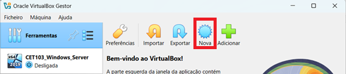
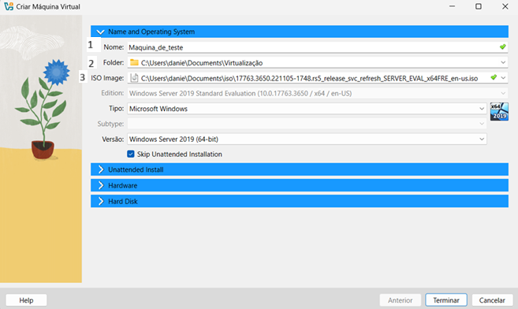
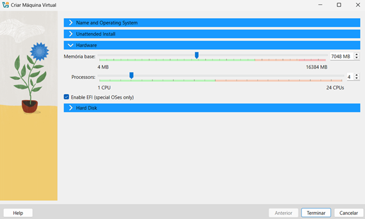

# Windows_Server_2019_CET103
Manual de criação e configuração de um servidor Windows Server 2019 para CET103.

# Índice
[Manual](#manual)

- [Criação da máquina virtual](#criação-da-máquina-virtual)

- [Instalação do Sistema Operativo](#instalação-do-sistema-operativo)

- [Configurar o servidor](#configurar-o-servidor)

- [Configuração RAID 5](#configuração-raid-5)

- [Configuração do servidor](#configuração-do-servidor)

- [Atribuição de um IP na rede interna](#atribuição-de-um-ip-na-rede-interna)

- [Instalação do Active Directory](#instalação-do-active-directory)

- [Configuração do Domain Service](#configuração-do-domain-service)

- [Configurar o DNS](#configurar-o-dns)

- [Instalação e configuração do DHCP](#Instalação-e-configuração-do-DHCP)

- [NIC Teaming](#NIC-Teaming)

- [Windows Server Backup](#Windows-Server-Backup)

- [Active Directory](#Active-Directory)

- [Group Policy Objects (GPO)](#Group-Policy-Objects-(GPO))

## Manual
### Criação da máquina virtual
> [!NOTE]
> A instalação e configuração do Windows Server 2019 foi realizada num software de virtualização onde foi criada uma máquina virtual (virtual machine), neste caso irá ser utilizado o VirtualBox.
 
Dentro do VirtualBox, para criar uma máquina virtual de um Windows Server 2019, clicar na opção `Nova`.
 
 

 
 
Vamos dar um nome á máquina virtual, neste caso será `Maquina_de_teste` **(1)**, escolher o local onde irá estar guardado o conteúdo da máquina virtual **(2)** e escolher o ficheiro .iso **(3(imagem do sistema operativo escolhido))**.
 

 
 
Na secção do Hardware iremos configurar as especificações da máquina virtual, neste caso a máquina irá ter `7 gigabytes de memória` e `4 processadores`.
Temos estes parâmetros para que a máquina não fique lenta.
 

 
 
Na secção `Hard Disk` iremos colocar o tamanho do disco pretendido (indicar quanto espaço queremos na nossa máquina virtual).
Para um bom funcionamento pelo menos **40 gigabytes** são necessários.
 

 
 
De seguida clicamos em `Terminar` e a criação da máquina virtual estará completa.
Para iniciar a máquina virtual clicar em `Iniciar`. A máquina irá iniciar.
Será necessário configurar o sistema operativo escolhido, neste caso irá ser o Windows server 2019.

### Instalação do Sistema Operativo

Durante o setup irão aparecer várias opções, mas a que é preciso é a opção **Datacenter Evaluation (Desktop Experience)** para criar um servidor com interface gráfica.

De seguida aceita-se os termos de licensa, escolhe-se a opção **custom: Install Windows only (advanced)** e escolhemos a **drive** desejada onde queremos **instalar o sistema operativo**. E será instalado o sistema operativo.

Depois de instalar o sistema operativo será necessário **reiniciar** a máquina virtual.

## Configurar o servidor

### Configuração RAID 5

**RAID 5** é uma tecnologia de armazenamento que junta vários discos rígidos (HDDs ou SSDs) para funcionarem como um só sistema. Este tipo de RAID oferece desempenho, capacidade de armazenamento e tolerância a falhas.

Antes de se iniciar a máquina virtual, vamos a **armazenamento**, clicamos no ícone com um mais e escolhemos **Add SCSI Controller**.

Clicamos em **Add Hard Disk**, e escolhemos **Create new disk**.

De seguida iniciamos a máquina virtual. No server manager clicamos em **Tools** e de seguida **Computer Management**.
Iremos para **Storage** e em seguida **Disk Management**, onde conseguimos ver as partições.

Nos discos não inicializados clicamos com o botão direito do rato e escolhemos a opção **Online**. Fazemos o mesmo para os restantes discos que se encontram offline.

De seguida com o botão direito do rato clicamos no disco e escolhemos a opção **Initialize Disk**, selecionamos todos os discos e a opção **GPT (GUID Partition Table)**.

Com o botão direito do rato clicamos num disco não alocado e escolhemos a opção **Convert to Dynamic Disk**, selcionamos os discos e clicamos **Ok**.

Com obotão direito do rato cliamos sobre um dos discos e escolhemos a opção **New RAID-5 Volume...** para inicar o assistente.

Iremos agora esxcolher os discos que queremos que façam parte do RAID, selcionamos os discos e clicamos **Next**.
E de seguida escolhemos a letra do novo volume.

Definimos as opções de formatação, no final o volume RAID 5 irá ser entrar no processo de formatação e sincronização.

### Configuração do servidor

Neste passo é necessário mudar o nome do servidor e atribuir um sufixo DNS.
O nome será **Daniel** e o sufixo DNS será **pilao.pt**.

### Atribuição de um IP na rede interna

Neste passo irá ser atribuído um IP fixo á minha rede interna, irei mudar o nome dos adaptadores para não se confundirem, á rede interna irei mudar o nome para **Int** e para a rede externa irei mudar o nome para **Ext**.

Irá agora ser atribuído um IP fixo á rede interna ao configurar o adaptador **Int**.
Com o botão direito do rato, clicar em **Properties**, escolhendo a opção **Internet Protocol Version 4 (TCP/IPv4)** e de seguida **Properties** outravez.

Nesta janela irá ser necessário introduzir um **IP** e uma **Subnet mask** (irão ser atribuidos IPs ás máquinas que fazem parte da rede interna e que estiverem ligadas ao servidor).
O IP escolhido será **192.168.1.200** e a Subnet mask **255.255.255.0**. Clicar em **Advanced**.

Na opção **Interface Metric** irei colocar **1**, fazendo com que este adaptador tenha prioridade na ligação da máquina, e premir **Ok**.

Para o adaptador externo iremos só colocar no **Interface Metric** o número **20**.

Para testar o funcionamento da configuração, abrir o **cmd**, e usamos o comando **ping**, iremos fazer ping ao IP escolhido anteriormente.

Ao escrever **ipconfig** no cmd vejo as definições dos adaptadores de rede.

### Instalação do Active Directory

O **Active Directory (AD)** é um serviço de diretório da Microsoft que centraliza e organiza informações sobre recursos de rede. Ele é usado para gerir contas de usuário, computadores, impressoras e outros recursos. 
O AD é usado em ambientes corporativos que utilizam sistemas operacionais Windows. 

**Principais funcionalidades do AD**
- Armazenar informações sobre objetos na rede, como usuários, computadores, impressoras e serviços
- Fornecer uma estrutura hierárquica e lógica para organizar as informações de diretório
- Controlar a autenticação e autorização de usuários e computadores
- Fornecer políticas de segurança

**Configurar o AD**
No canto superior direito iremos clicar na opção **Manage** e de seguida **Add Roles and Features**.

Iremos **Next** até chegarmos á etapa **Server Selection**.

Escolhemos o servidor desejado, que irá funcionar como controlador de dominio (neste caso iremos ter só uma opção). Clicamos **Next**.

No passo seguinte escolhemos a opção **Active Directory Domain Services**. Continuamos com a instalação.

No final da instalação será necessário **reiniciar**.

### Configuração do Domain Service

Na secção **AD DS** no Server Manager irá ter um alerta para configurar o Domain Service. Clicamos na opção **More...**.

Iremos escolher a opção sobrelinhada.

Escolhemos a opção **Add a new forest** com o Root domain name **pilao.pt**.

Na página seguinte escolhemos uma password para o **DSRM**, para que se necessário haja a **manutenção** e **recuperação** da base de dados do **AD**. E clicamos **Next**.

Iremos clicar **Next** até aparecer a opção **Install**. Clicamos.
O computador irá **reiniciar** quando completar a instalação.

### Configurar o DNS

**O que é o DNS**

DNS é a sigla para **Domain Name System**, que significa Sistema de Nomes de Domínio. É um serviço que permite aos utilizadores acederem à internet através de nomes de domínio, como "google.com" em vez de memorizar IPs.

Para configurar o DNS, no server manager na opção tools escolher a opção **DNS** para abrir o **DNS Manager**.

No painel, clicar com o botão direito do rato na opção **Reverse Lookup Zones** selecionando a opção **New Zone**.

Irá aparecer a janela do setup, escolher a opção **Next**, de seguida escolher a opção **Primary zone**, esta opção faz com que este servidor DNS seja responsável por manter e gerir de forma principal, armazenando os registos DNS. Clicamos **Next**.

Escolhemos a opção **To all DNS servers running on domain controllers in this domain: pilao.pt**, para replicar a zona de DNS apenas para os servidores DNS que estão a executar controladores de domínio dentro do domínio **pilao.pt**, clicamos **Next** e na próxima etapa escolhemos a opção **IPv4 Reverse Lookup Zone**, clicamos **Next**.

Coloquei o endereço IP da rede interna, que será **192.168.1**, e cliquei **Next**.

Escolher a opção **Allow only secure dynamic updates**, clicamos **Nex** e damos por terminado o setup.

Para concluir a configuração do Reverse Lookup é preciso criar um novo **Pointer** e indicar que o meu servidor é aquele que faça a conversão, indicando o **host**.

Testar o foward lookup e o reverse lookup para confirmar se o servidor está a fazer a correta conversão.

### Instalação e configuração do DHCP

Para começar-mos a instalação e configuração do DHCP clicamos no **Manage** e de seguida **Add Roles and Features**.

Na instalação escolhemos a opção **DHCP Server** e clicamos **Next** até o botão **Install** fique ativo, instalamos.

Depois da instalação aparece um aviso no Server Manager, o DHCP precisa de ser configurado.

Para criar um scope DHCP selecionamos **Tools**, clicamos em **DHCP**, no painel da esquerda clicamos com o botão direito do rato em cima do **IPv4** e clicamos em **New Scope...**, iniciando o Wizard.

O nome e a descrição será **"Aulas"**, clicamos **Next**.

Indicamos os intervalos de endereços de IP.

Definimos agora IPs dentro de um intervalo que não queremos que sejam atribuídos automaticamente, clicamos **Next**.

Escohemos a opção **Yes, I want to configure these options now**.

De seguida indicamos o endereço de IP do nosso servidor, sendo esse o dispositivo que faz a ligação á rede.
Neste caso será **192.168.1.200**
Clicamos em **Add** e de seguida **Next**.

Clicamos **Next** até aparecer para escolhermos umas das opções, escolhemos a opção **Yes, I want to activate this scope now**.

### NIC Teaming

NIC Teaming é uma técnica usada para combinar duas ou mais placas de rede físicas num único interface lógico.

Fora da máquina virtual adicionamos mais 2 placas de rede.

Dentro da máquina virtual mudei o nome das placas para as identificar mais facilmente.

No Server Manager clicamos na opção **Disabled** á frente de **NIC Teaming**.

Em cima de uma das placas clicamos com o botão direito e escolhemos a opção **Add to New Team**.

Escolhemos o **Team name**, escolhemos as placas, escolhemos **Aditional Properties** e de seguida **Next**.

E fazemos o mesmo para a rede interna.

### Windows Server Backup

Para instalar o **Windows Server Backup** clicamos em **Manage** e de seguida em **Add Roles and Features**.

Avançamos até **Features** e selecionamos **Windows Server Backup**, clicamos em **Install**.

Para criar o agendamento do Backup clicamos em **Tools** e de seguida **Windows Server Backup**.

Na próxima janela, na parte esquerda da janela, clicamos em **Local Backup** e na parte direita iniciamos o Wizard ao clicar **Backup Schedule...**.

Concluido o Wizard irá estar concluida a instalação do **Windows Server Backup**.

### Active Directory

Clicamos em **Tools**, **Active Directory Users and Computers**.

De seguida com o botão direito clicar em **pilao.pt**.

Criamos duas pastas, **Cinel_Lisboa** e **Cinel_Porto**.

Dentro da pasta **Cinel_Lisboa** criamos três sub-pastas com o nome de **IT**, **HR** e **Finance**. Da mesma maneira que criámos as pastas iniciais.

De seguida, criamos dois grupos dentro de **IT** com o nome de **IT_Admins** e **IT_Analysts**. Ambos de scope **Global** e type **Security**.

Para criar um utilizador na pasta **IT** clicamos com o botão direito, clicamos em **New** e de seguida **User**.

O nome do novo User será **João Silva** e o User Logon name será **jsilva**.

De seguida criamos uma password e marcamos a opção **User must change password at next logon**.

Para juntarmos um User a um grupo clicamos com o botão direito em cima do User e clicamos **Add to a group...**.

### Group Policy Objects (GPO)

Para começar iremos a **tools** e de seguida **Group Policy Management**.

Vamos até **Group Policy Objects** e clicamos com o botão direito do rato, de seguida **New**.
Escolhemos um nome, neste caso será **DC-Segurança**.

