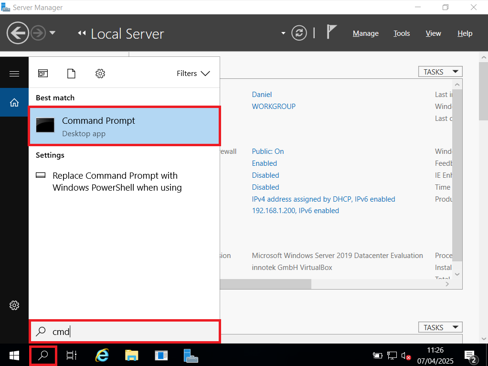
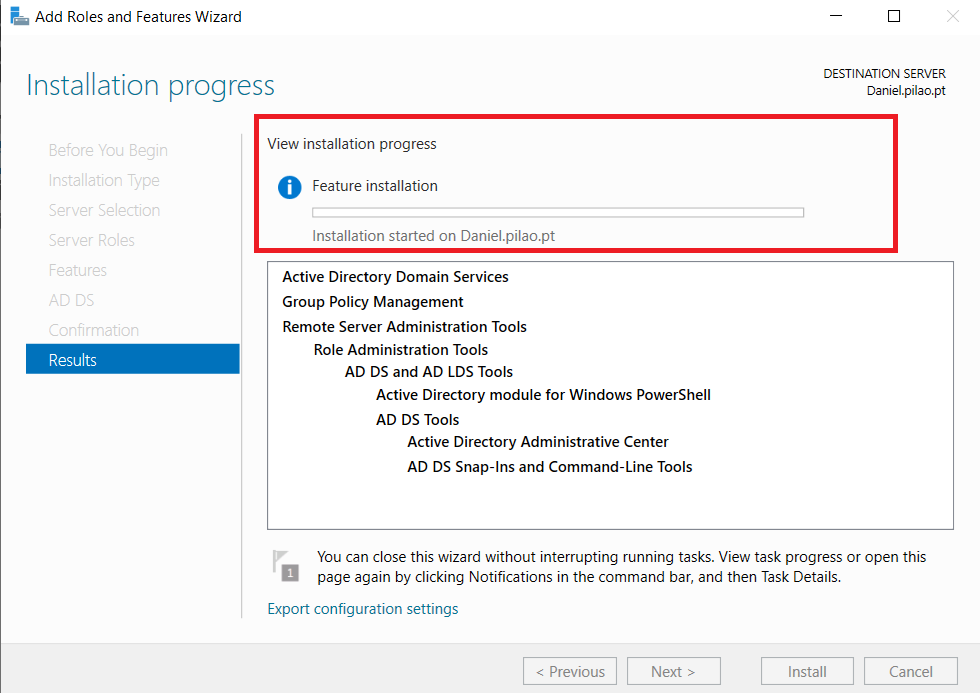
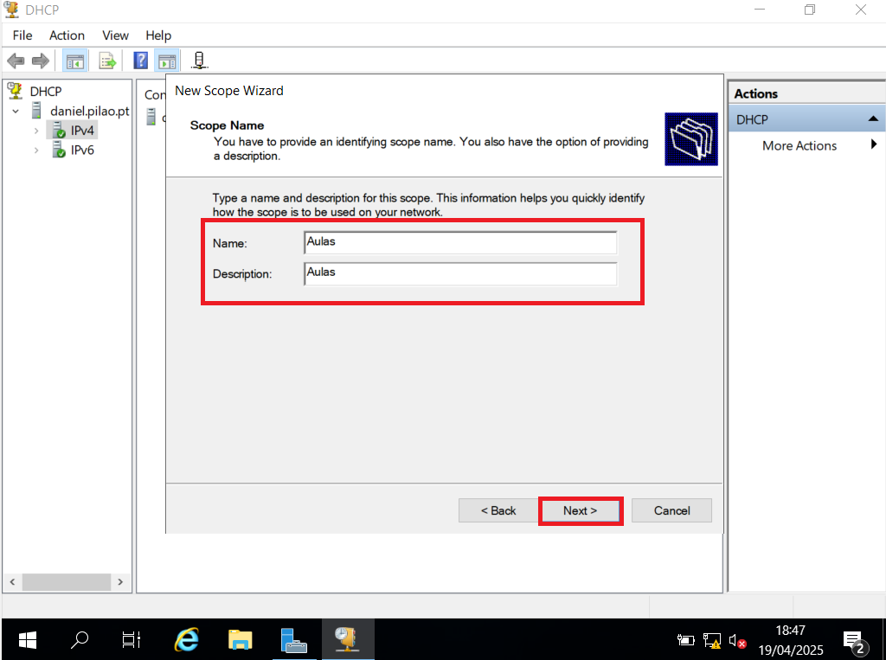

<!-- PROJECT LOGO -->
 

  

  <h3 align="center">Windows Server 2019</h3>
  <h4 align="center">Manual CET 103</h4>

  
Manual de criação e configuração do Windows Server 2019

<!-- TABLE OF CONTENTS -->

  
Índice

  <ol>
     <li>
      <a href="#sobre-o-manual">Sobre o manual</a>
    </li>
    <li>
      <a href="#software-de-virtualização">Software de virtualização</a>
    </li>
    <li>
      <a href="#criação-e-configuração-da-máquina-virtual">Criação e configuração da máquina virtual</a>
    </li>
    <li>
      <a href="#instalação-e-configuração-do-sistema-operativo">Instalação e configuração do Sistema Operativo</a>
    </li>
    <li><a href="#roadmap">Configuração do servidor</a>
    <ul>
        <li><a href="#active-directory">Active Directory</a></li>
      <li><a href="#domain-service">Domain Service</a></li>
        <li><a href="#dns">DNS</a></li>
      <li><a href="#dhcp">DHCP</a></li>
      <li><a href="#nic-teaming">NIC Teaming</a></li>
      </ul>
      </li>
    <li><a href="#configuração-do-raid-5">Configuração do RAID 5</a></li>
    <li><a href="#server-backup">Server Backup</a></li>
    <li><a href="#configuração-do-active-directory">Configuração do Active Directory</a></li>
    <ul>
        <li><a href="#criação-de-grupos-e-utilizadores">Criação de grupos e utilizadores</a></li>
        <li><a href="#group-policy-objects">Group Policy Objects</a></li>
      </ul>
    <li><a href="#Creditos">Créditos</a></li>
  </ol>

<!-- ABOUT THE PROJECT -->
## Sobre o manual

Este manual foi desenvolvido para o curso CET103, destinado para a avaliação e armazenamento de conhecimentos.

## Software de virtualização

Foi utilizado o software VirtualBox para a criação e configuração do Windows Server 2019.

  

<!-- GETTING STARTED -->
## Criação e configuração da máquina virtual

Dentro do VirtualBox escolhemos a opção `Nova`.

    
  </a>
  

Damos o nome á máquina, será `Maquina_de_teste` **(1)**, escolhemos a pasta onde ficará guardada **(2)** e escolhemos o .iso do Sistema Operativo desejado **(3)**.

    
  </a>

 

Em termos de Hardware a máquina irá ter `7 GB de RAM`, `4 processadores` e `50 GB de armazenamento`.

    
  </a>

  

    
  </a>

Podemos iniciar a máquina virtual.

## Instalação e configuração do Sistema Operativo

Iniciamos a máquina virtual e fazemos o setup do Windows Server 2019.

    
  </a>

    
  </a>

    
  </a>
  

    
  </a>

    
  </a>

## Configuração do servidor

Com o SO instalado a primeira coisa a fazer é mudar o nome do servidor e atribuir um sufixo DNS.

    
  </a>

    
  </a>

    
  </a>

    
  </a>

    
  </a>
  
Alteramos o nome da rede interna e da rede externa e atribuimos um IP á rede interna.

    
  </a>

  

    
  </a>

    
  </a>

  

    
  </a>

    
  </a>

    
  </a>

  

    
  </a>

    
  </a>    

  

    
  </a>

    

    
  </a>

  
  ## Active Directory

O Active Directory (AD) é um serviço de diretório desenvolvido pela Microsoft, fundamental para o gerenciamento de redes Windows em ambientes corporativos. Pense nele como uma central de informações e controle para tudo que existe na sua rede.

    
  </a>

    
  </a>

  

    
  </a>

    

    
  </a>

  

    
  </a>

    

    
  </a>

## Domain Service

    
  </a>

    
  </a>

    
  </a>

  

    
  </a>
    
  

    
  </a>

  ## DNS
  
O DNS (Domain Name System) é como se fosse a lista telefónica da Internet. Em vez de procurar um nome e obter um número de telefone, o DNS traduz nomes de domínio que são fáceis de ler para humanos (como www.google.com) em endereços IP numéricos que os computadores usam para comunicar.

 

    
  </a>

    
  </a>

    
  </a>

    
  </a>

    
  </a>

    
  </a>

    
  </a>

    
  </a>

    
  </a>

    
  </a>

  ## DHCP

O DHCP (Dynamic Host Configuration Protocol) é um protocolo de rede que atribui automaticamente endereços IP e outras informações de configuração de rede a dispositivos numa rede.

    
  </a>

    
  </a>

    
  </a>

    
  </a>

    
  </a>

    
  </a>

    
  </a>

    
  </a>

    
  </a>

    
  </a>

    
  </a>

    
  </a>

    
  </a>

    
  </a>

  ## NIC Teaming

NIC Teaming, também conhecido como agregação de ligações (link aggregation), agregação de portas (port aggregation), bonding de NICs, ou ainda Agrupamento de NICs (termo da Microsoft), é uma técnica utilizada em sistemas operativos (principalmente Windows Server, mas também noutros como Linux) que permite combinar múltiplas placas de rede físicas (NICs) num único servidor, para que funcionem como uma única interface de rede lógica.

    
  </a>

    
  </a>

    
  </a>

    
  </a>

    
  </a>

    
  </a>

## Configuração do RAID 5

RAID é o acrónimo para Redundant Array of Inexpensive Disks (ou, mais modernamente, Redundant Array of Independent Disks). É uma tecnologia de armazenamento de dados que permite combinar vários discos rígidos (HDDs ou SSDs) numa única unidade lógica, com o objetivo de melhorar o desempenho, a redundância ou ambos.

O RAID 5 é um dos níveis de RAID mais comuns e populares em ambientes empresariais de pequena e média dimensão, equilibrando bem desempenho, tolerância a falhas e eficiência de armazenamento.

    
  </a>

    
  </a>

    
  </a>

    
  </a>

    
  </a>

    
  </a>

    
  </a>

    
  </a>

    
  </a>

    
  </a>

    
  </a>

    
  </a>

    
  </a>

    
  </a>

    
  </a>

  ## Server Backup

Server Backup (ou Cópia de Segurança de Servidor) refere-se ao processo de criar e armazenar cópias dos dados, aplicações e configurações de um servidor para poder recuperá-los em caso de perda de dados ou falha do sistema.

    
  </a>

    
  </a>

    
  </a>

    
  </a>

    
  </a>

## Configuração do Active Directory

O Active Directory (AD) é um serviço de diretório da Microsoft, uma espécie de base de dados centralizada que organiza e gere todos os recursos e utilizadores numa rede baseada em Windows.

### Criação de grupos e utilizadores

    
  </a>

    
  </a>

    
  </a>

    
  </a>

    
  </a>

### Group Policy Objects

    
  </a>

    
  </a>

<!-- USAGE EXAMPLES -->
## Créditos

Manual realizado por Daniel Egrejas.
