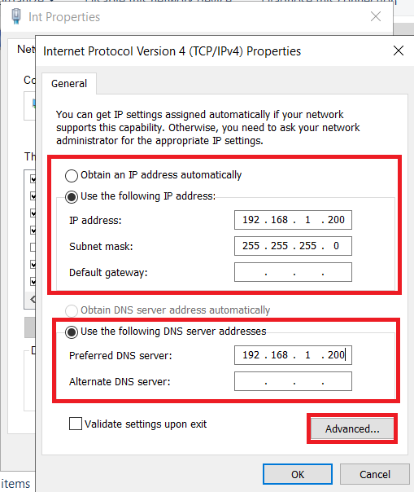
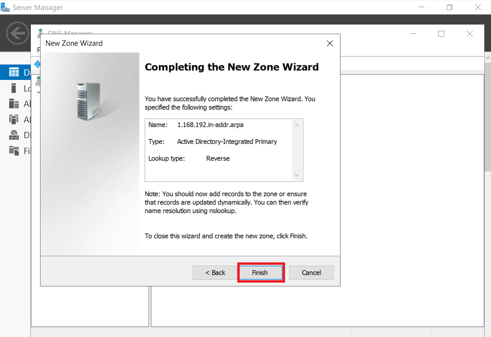

<!-- PROJECT LOGO -->
 

  

  <h3 align="center">Windows Server 2019</h3>
  <h4 align="center">Manual CET 103</h4>

  
Manual de criação e configuração do Windows Server 2019

<!-- TABLE OF CONTENTS -->

  
Índice

  <ol>
     <li>
      <a href="#sobre-o-manual">Sobre o manual</a>
    </li>
    <li>
      <a href="#software-de-virtualização">Software de virtualização</a>
    </li>
    <li>
      <a href="#criação-e-configuração-da-máquina-virtual">Criação e configuração da máquina virtual</a>
    </li>
    <li>
      <a href="#instalação-e-configuração-do-sistema-operativo">Instalação e configuração do Sistema Operativo</a>
    </li>
    <li><a href="#roadmap">Configuração do servidor</a>
    <ul>
        <li><a href="#active-directory">Active Directory</a></li>
      <li><a href="#domain-service">Domain Service</a></li>
        <li><a href="#dns">DNS</a></li>
      <li><a href="#dhcp">DHCP</a></li>
      <li><a href="#installation">NIC Teaming</a></li>
      </ul>
      </li>
    <li><a href="#configuração-do-raid-5">Configuração do RAID 5</a></li>
    <li><a href="#contributing">Server Backup</a></li>
    <li><a href="#license">Segundo DC</a></li>
    <li><a href="#contact">Configuração do Active Directory</a></li>
    <ul>
        <li><a href="#prerequisites">Criação de grupos e utilizadores</a></li>
        <li><a href="#installation">Group Policy Objects</a></li>
      </ul>
    <li><a href="#acknowledgments">Adição de um client</a></li>
  </ol>

<!-- ABOUT THE PROJECT -->
## Sobre o manual

Este manual foi desenvolvido para o curso CET103, destinado para a avaliação e armazenamento de conhecimentos.

## Software de virtualização

Foi utilizado o software VirtualBox para a criação e configuração do Windows Server 2019.

  

<!-- GETTING STARTED -->
## Criação e configuração da máquina virtual

Dentro do VirtualBox escolhemos a opção `Nova`.

    
  </a>
  

Damos o nome á máquina, será `Maquina_de_teste` **(1)**, escolhemos a pasta onde ficará guardada **(2)** e escolhemos o .iso do Sistema Operativo desejado **(3)**.

    
  </a>

 

Em termos de Hardware a máquina irá ter `7 GB de RAM`, `4 processadores` e `50 GB de armazenamento`.

    
  </a>

  

    
  </a>

Podemos iniciar a máquina virtual.

## Instalação e configuração do Sistema Operativo

Iniciamos a máquina virtual e fazemos o setup do Windows Server 2019.

    
  </a>

    
  </a>

    
  </a>
  

    
  </a>

    
  </a>

## Configuração do servidor

Com o SO instalado a primeira coisa a fazer é mudar o nome do servidor e atribuir um sufixo DNS.

    
  </a>

    
  </a>

    
  </a>

    
  </a>

    
  </a>
  
Alteramos o nome da rede interna e da rede externa e atribuimos um IP á rede interna.

    
  </a>

  

    
  </a>

    
  </a>

  

    
  </a>

    
  </a>

    
  </a>

  

    
  </a>

    
  </a>    

  

    
  </a>

    

    
  </a>

  
  ## Active Directory

O Active Directory (AD) é um serviço de diretório desenvolvido pela Microsoft, fundamental para o gerenciamento de redes Windows em ambientes corporativos. Pense nele como uma central de informações e controle para tudo que existe na sua rede.

    
  </a>

    
  </a>

  

    
  </a>

    

    
  </a>

  

    
  </a>

    

    
  </a>

## Domain Service

    
  </a>

    
  </a>

    
  </a>

  

    
  </a>
    
  

    
  </a>

  ## DNS
  
O DNS (Domain Name System) é como se fosse a lista telefónica da Internet. Em vez de procurar um nome e obter um número de telefone, o DNS traduz nomes de domínio que são fáceis de ler para humanos (como www.google.com) em endereços IP numéricos que os computadores usam para comunicar.

 

    
  </a>

    
  </a>

    
  </a>

    
  </a>

    
  </a>

    
  </a>

    
  </a>

    
  </a>

    
  </a>

    
  </a>

  ## DHCP

  
<!-- USAGE EXAMPLES -->
## Usage

Use this space to show useful examples of how a project can be used. Additional screenshots, code examples and demos work well in this space. You may also link to more resources.

_For more examples, please refer to the [Documentation](https://example.com)_

(<a href="#readme-top">back to top</a>)

<!-- ROADMAP -->
## Roadmap

- [x] Add Changelog
- [x] Add back to top links
- [ ] Add Additional Templates w/ Examples
- [ ] Add "components" document to easily copy & paste sections of the readme
- [ ] Multi-language Support
    - [ ] Chinese
    - [ ] Spanish

See the [open issues](https://github.com/othneildrew/Best-README-Template/issues) for a full list of proposed features (and known issues).

(<a href="#readme-top">back to top</a>)

<!-- CONTRIBUTING -->
## Contributing

Contributions are what make the open source community such an amazing place to learn, inspire, and create. Any contributions you make are **greatly appreciated**.

If you have a suggestion that would make this better, please fork the repo and create a pull request. You can also simply open an issue with the tag "enhancement".
Don't forget to give the project a star! Thanks again!

1. Fork the Project
2. Create your Feature Branch (`git checkout -b feature/AmazingFeature`)
3. Commit your Changes (`git commit -m 'Add some AmazingFeature'`)
4. Push to the Branch (`git push origin feature/AmazingFeature`)
5. Open a Pull Request

### Top contributors:

(<a href="#readme-top">back to top</a>)

<!-- LICENSE -->
## License

Distributed under the Unlicense License. See `LICENSE.txt` for more information.

(<a href="#readme-top">back to top</a>)

<!-- CONTACT -->
## Contact

Your Name - [@your_twitter](https://twitter.com/your_username) - email@example.com

Project Link: [https://github.com/your_username/repo_name](https://github.com/your_username/repo_name)

(<a href="#readme-top">back to top</a>)

<!-- ACKNOWLEDGMENTS -->
## Acknowledgments

Use this space to list resources you find helpful and would like to give credit to. I've included a few of my favorites to kick things off!

* [Choose an Open Source License](https://choosealicense.com)
* [GitHub Emoji Cheat Sheet](https://www.webpagefx.com/tools/emoji-cheat-sheet)
* [Malven's Flexbox Cheatsheet](https://flexbox.malven.co/)
* [Malven's Grid Cheatsheet](https://grid.malven.co/)
* [Img Shields](https://shields.io)
* [GitHub Pages](https://pages.github.com)
* [Font Awesome](https://fontawesome.com)
* [React Icons](https://react-icons.github.io/react-icons/search)

(<a href="#readme-top">back to top</a>)

<!-- MARKDOWN LINKS & IMAGES -->
<!-- https://www.markdownguide.org/basic-syntax/#reference-style-links -->
[contributors-shield]: https://img.shields.io/github/contributors/othneildrew/Best-README-Template.svg?style=for-the-badge
[contributors-url]: https://github.com/othneildrew/Best-README-Template/graphs/contributors
[forks-shield]: https://img.shields.io/github/forks/othneildrew/Best-README-Template.svg?style=for-the-badge
[forks-url]: https://github.com/othneildrew/Best-README-Template/network/members
[stars-shield]: https://img.shields.io/github/stars/othneildrew/Best-README-Template.svg?style=for-the-badge
[stars-url]: https://github.com/othneildrew/Best-README-Template/stargazers
[issues-shield]: https://img.shields.io/github/issues/othneildrew/Best-README-Template.svg?style=for-the-badge
[issues-url]: https://github.com/othneildrew/Best-README-Template/issues
[license-shield]: https://img.shields.io/github/license/othneildrew/Best-README-Template.svg?style=for-the-badge
[license-url]: https://github.com/othneildrew/Best-README-Template/blob/master/LICENSE.txt
[linkedin-shield]: https://img.shields.io/badge/-LinkedIn-black.svg?style=for-the-badge&logo=linkedin&colorB=555
[linkedin-url]: https://linkedin.com/in/othneildrew
[product-screenshot]: images/screenshot.png
[Next.js]: https://img.shields.io/badge/next.js-000000?style=for-the-badge&logo=nextdotjs&logoColor=white
[Next-url]: https://nextjs.org/
[React.js]: https://img.shields.io/badge/React-20232A?style=for-the-badge&logo=react&logoColor=61DAFB
[React-url]: https://reactjs.org/
[Vue.js]: https://img.shields.io/badge/Vue.js-35495E?style=for-the-badge&logo=vuedotjs&logoColor=4FC08D
[Vue-url]: https://vuejs.org/
[Angular.io]: https://img.shields.io/badge/Angular-DD0031?style=for-the-badge&logo=angular&logoColor=white
[Angular-url]: https://angular.io/
[Svelte.dev]: https://img.shields.io/badge/Svelte-4A4A55?style=for-the-badge&logo=svelte&logoColor=FF3E00
[Svelte-url]: https://svelte.dev/
[Laravel.com]: https://img.shields.io/badge/Laravel-FF2D20?style=for-the-badge&logo=laravel&logoColor=white
[Laravel-url]: https://laravel.com
[Bootstrap.com]: https://img.shields.io/badge/Bootstrap-563D7C?style=for-the-badge&logo=bootstrap&logoColor=white
[Bootstrap-url]: https://getbootstrap.com
[JQuery.com]: https://img.shields.io/badge/jQuery-0769AD?style=for-the-badge&logo=jquery&logoColor=white
[JQuery-url]: https://jquery.com 
